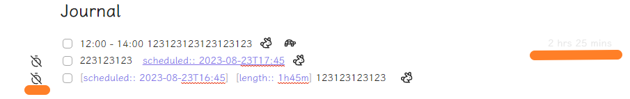

# Obsidian Time Counter

> This plugin is not OPEN SOURCE
> It has basic features for free, but you need to pay for advanced features.
> If you ever buy me a coffee, you can get a free license.
> If you want to buy a license, please contact me by email: bonopengate@gmail.com

This plugin is a time counter for Obsidian. It can count the time you spend on each note task.

## Basic Features

- Insert a time counter to the note;
- Count the time counter and append them near the task;

## Advanced Features

- Support rendering time counter in both live preview and also preview mode;
- Support logbook time counter;
- Support play and pause time counter;
- Support time counter in the preview mode;
- Support custom icon for time counter;

## Usage

1. Install this plugin;
2. Enable this plugin;
3. Use context menu or command palette to insert a start time counter;
4. Enjoy it!

## Installation

- Not ready for market yet
- Can be installed via the [Brat](https://github.com/TfTHacker/obsidian42-brat) plugin
- Manual installation

1. Find the release page on this github page and click
2. Download the latest release zip file
3. Unzip it, copy the unzipped folder to the obsidian plugin folder, make sure there are main.js and manifest.json files
   in the folder
4. Restart obsidian (do not restart also, you have to refresh plugin list), in the settings interface to enable the
   plugin
5. Done!

## Support

If you are enjoying this plugin then please support my work and enthusiasm by buying me a coffee;

OR

You can buy a license for this plugin, please contact me by email above.

